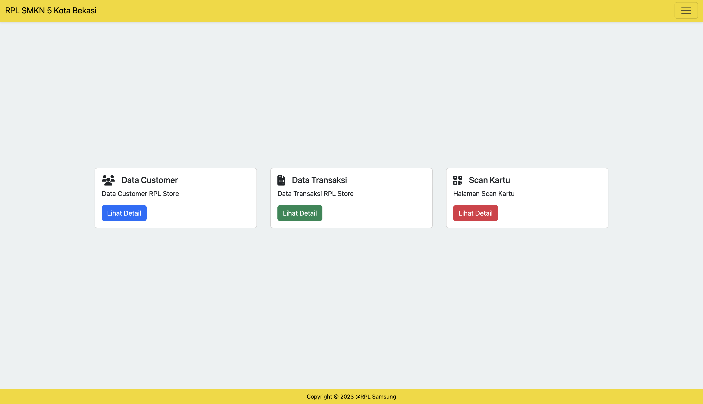
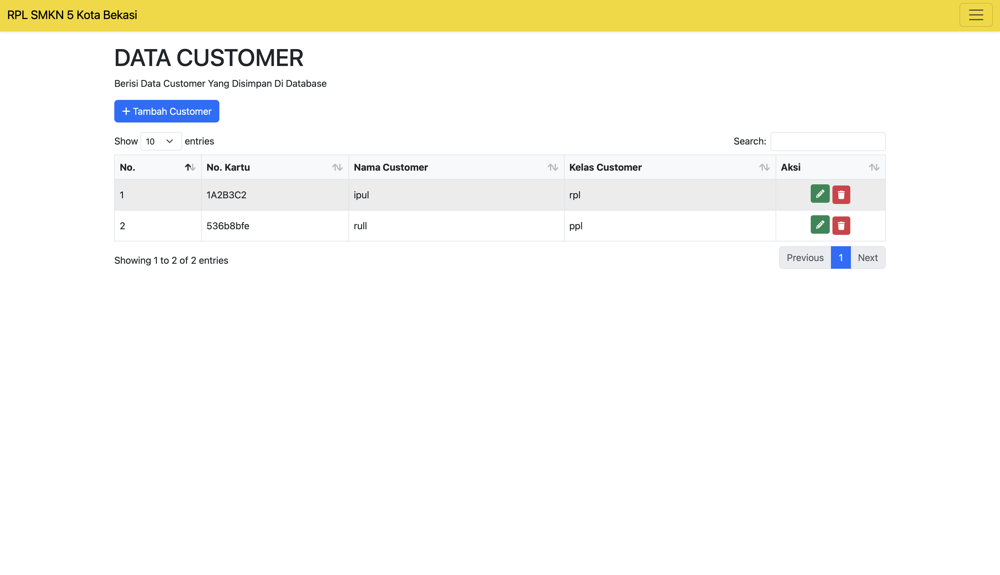
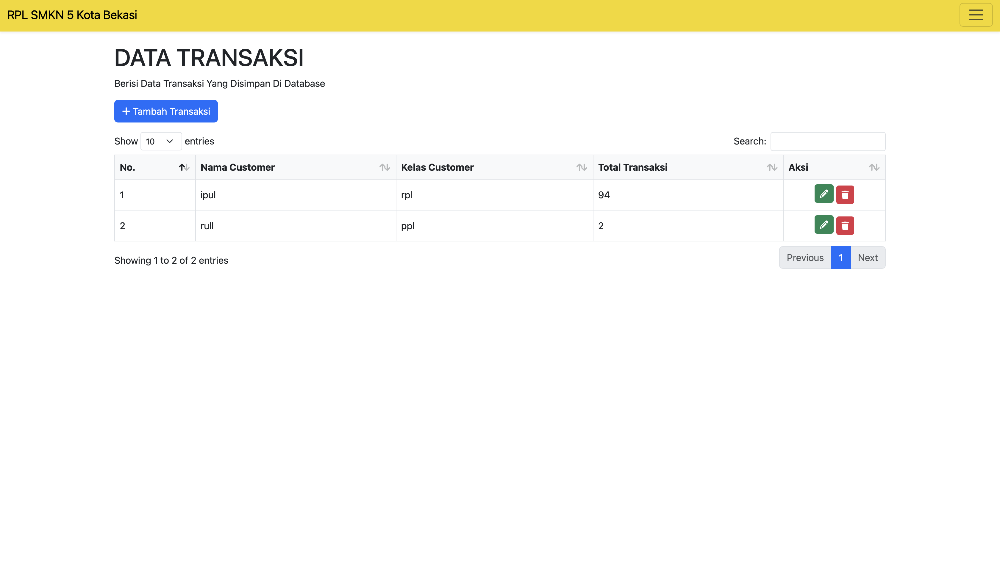
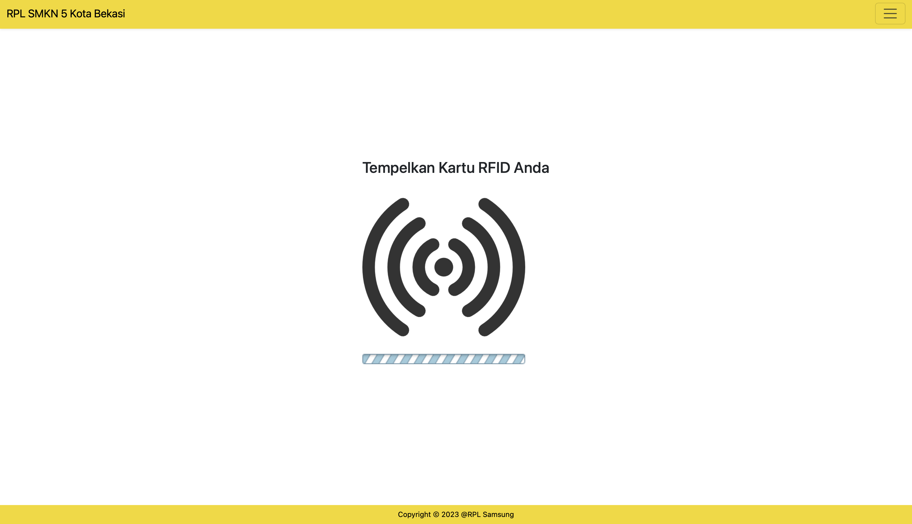
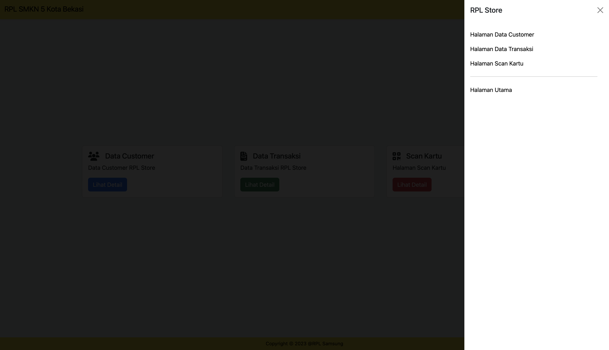

# Smart Admin PHP MySQL RFID

Smart Admin is a web application integrated with IoT for card scanning. It offers features for managing customer data, transaction data, and card scanners. Admin can create, read, update, and delete data, making data management efficient and effective.

| Landing Page                                            | Customer Data                                             | Transaction Data                                                |
| ------------------------------------------------------- | --------------------------------------------------------- | --------------------------------------------------------------- |
|  |  |  |

| Scanner Page                                            | Side Nav                                        | Mockup                                       |
| ------------------------------------------------------- | ----------------------------------------------- | -------------------------------------------- |
|  |  |  |

## Main Features

- **Customer Data Management**: Easily add, view, edit, and delete customer data.
- **Transaction Data Management**: Monitor and manage transaction data efficiently.
- **RFID Card Scanner**: IoT integration for card scanning, facilitating identification and authorization.
- **CRUD (Create, Read, Update, Delete)**: Full functionality for managing all data.

## Technologies Used

- **Backend**: PHP
- **Database**: MySQL
- **IoT Integration**: RFID Scanner

## Installation

1. **Clone this repository**

   ```bash
   git clone https://github.com/username/smart-admin-php-mysql-rfid.git
   cd smart-admin-php-mysql-rfid
   ```

2. **Database Configuration**

   - Create a new database in MySQL named `rpl_store`.
   - Import the `database.sql` file from `db/database.sql` into your database.
   - Configure the database connection in the `config.php` file.

3. **Server Configuration**

   - Ensure that a web server (Apache, Nginx) and PHP are installed.
   - Place this project in the root directory of your web server.

## Usage

**Data Management**

- Navigate to the customer or transaction menu to manage data.
- Use the RFID scanner for card scanning and authorization and dont forget to hit your url target. For example: `https://urHost/scanKartu/kirimKartu.php?no_kartu=A687UH76HK`.

## Contribute

If you would like to contribute to this project, please fork the repository and create a pull request with your changes.

## Contact

For any questions or suggestions, please contact [akbarekaputra01@gmail.com](mailto:akbarekaputra01@gmail.com) or dm me on instagram @akbarekaputra01
